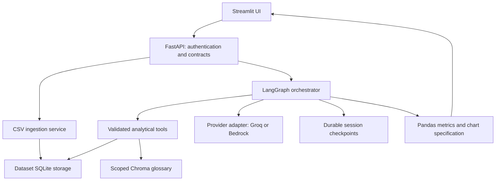
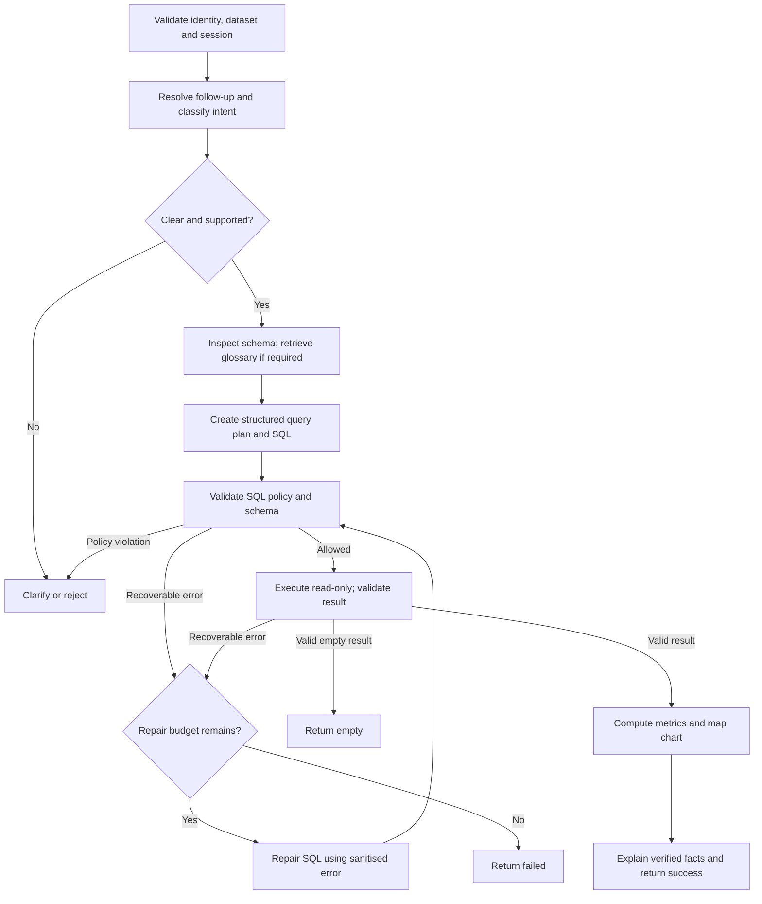

# Agentic Data Analyst
## Architecture, Specification, Implementation Tasks & Coding-Agent Prompt

**Owner:** Omrohit Channoji  
**Version:** 1.0 · 29 September 2026  
**Purpose:** Upgrade an existing GenAI Data Analyst into a deployed, evaluated, stateful text-to-SQL application.  
**Scope:** A focused AI engineering portfolio project with optional Bedrock integration.

> Give this document and the existing repository to your coding agent. Start with the master prompt in Section 12. This is a build specification, not evidence that any capability has already been implemented.

---

## 1. Product outcome

A user uploads a supported CSV, selects that dataset, and asks analytical questions in natural language. The application can clarify ambiguous questions, resolve follow-ups, retrieve approved business definitions, generate and safely execute SQL, repair recoverable errors, and return verified results with an appropriate chart and explanation.

The agent is a **single bounded workflow**. The model interprets questions and proposes structured actions. Application code controls permissions, tools, transitions, execution limits, arithmetic, and rendering.

### Core release

- Preserve working upload, analysis, and UI functionality.
- Support one selected dataset per conversation; cross-dataset joins are deferred.
- Support aggregations, filters, grouping, time trends, ranking, and supported comparisons.
- Support scoped follow-ups and business glossary retrieval.
- Return explicit success, empty, clarification, rejection, and failure outcomes.
- Evaluate against fixed data and trusted answers.
- Package for local Docker and a single EC2 deployment.

### Optional second release

- Add Amazon Bedrock behind the same provider interface as Groq.
- Compare both providers on the same evaluation cases.
- Add S3 for uploads/exports only if needed; it is not required for core completion.

### Out of scope

Multi-agent teams, unrestricted autonomous code execution, SQL writes through the agent, arbitrary external database connections, model fine-tuning, Kubernetes, multi-cloud deployment, and enterprise-scale tenancy. Do not add these to satisfy the project title.

## 2. Existing application and audit boundary

Expected components from the supplied plan: FastAPI, Streamlit, SQLite, Groq, Chroma, Pandas, Plotly, and an existing insights engine. These are starting assumptions to verify against the repository.

Before editing application code:

1. Read repository instructions and inspect the working tree without discarding changes.
2. Trace upload → cleaning → schema/context → SQL → execution → insights → charts.
3. Identify actual endpoint names and request/response contracts. Do not assume `/query` exists.
4. Confirm whether SQLite, Chroma, and sessions persist across requests and restarts.
5. Record dependency versions and current run/deploy commands.
6. Capture a reproducible baseline using a fixed sample dataset.
7. Identify components to reuse, wrap, replace, or remove with justification.

Preserve current public contracts where practical. If a response change would break clients, add a versioned route or compatibility adapter. Do not rewrite the entire application merely to match the proposed module names below.

## 3. Architecture

### 3.1 Application components



The analysis-to-UI edge represents returned data through the API, not direct backend access from the browser. The backend returns a constrained chart specification; Streamlit renders it with Plotly. Structured logs cover the API, graph, tools, and provider adapter.

### 3.2 Correct graph transitions



An overall deadline or exhausted model-call budget can terminate any active stage with a controlled failure. Missing glossary definitions can produce clarification before SQL generation. No repair path bypasses SQL validation. Invalid results never flow into analytics.

### 3.3 Model decisions versus code responsibilities

| Model may propose | Application must enforce |
|---|---|
| Answer, clarify, or mark unsupported | Allowed outcome schema and authorised scope |
| Need for a glossary lookup | Scoped retrieval and approved definitions |
| Metric, dimensions, filters, sorting and comparison | Schema/type checks and supported operations |
| SQL and a repair after feedback | SQL policy, execution timeout, attempt budget |
| Explanation of supplied facts | Evidence references, numeric consistency and fallback |

Do not claim autonomous tool selection solely because functions use `@tool`. The core design uses structured model decisions with deterministic dispatch. Native provider tool calling may implement the same contracts, but is not required to add an unrestricted tool loop.

## 4. Requirements and acceptance criteria

| ID | Requirement | Acceptance criterion |
|---|---|---|
| R01 | Preserve the baseline | Existing valid upload/query workflows pass, or a documented migration preserves the UI experience |
| R02 | Enforce scope | Dataset and session ownership are checked before schema retrieval, history access and query execution |
| R03 | Ground SQL | Only authorised tables, columns and supported functions can execute; safe CTE aliases resolve correctly |
| R04 | Enforce read-only execution | Mutations, multiple statements and prohibited operations are rejected; fixture data remains unchanged |
| R05 | Bound repair | At most 3 SQL attempts total: initial attempt plus 2 repairs; exhausted attempts return `failed` |
| R06 | Clarify ambiguity | Missing metric meaning, incompatible columns or unresolved references yield a specific clarification question |
| R07 | Preserve valid empty outcomes | A query with no matching rows returns `empty` without relaxing its filters |
| R08 | Manage follow-ups | Follow-ups use the same authorised session and dataset; dataset switching starts fresh analytical context |
| R09 | Ground glossary use | Definitions have source IDs and versions; missing/conflicting definitions prompt clarification |
| R10 | Compute correctly | SQL/Pandas results match trusted answers; nulls, zero denominators and truncation follow documented rules |
| R11 | Ground presentation | Every displayed number comes from verified data; chart axes and units match the intended analysis |
| R12 | Observe and limit work | Request IDs, timings, usage and attempts are recorded; request, tool and model budgets terminate work |
| R13 | Survive deployment restart | Dataset files and committed conversational state survive supported restarts without cross-session leakage |
| R14 | Support provider interchange | Optional Bedrock and Groq satisfy the same application contract; provider failure has a controlled outcome |

### Important example scenarios

- **Aggregation:** “Revenue by region” matches a reference grouped sum; order is irrelevant unless requested.
- **Follow-up:** “Only for 2025” retains the previous metric and grouping, changing only the intended date filter.
- **Ambiguity:** “Show the best customers” asks whether best means revenue, order count, or another defined measure.
- **Glossary:** “Active customers” uses an approved definition that maps to available columns; it does not invent a threshold.
- **Empty:** “Orders from a year outside the data range” returns an honest empty outcome.
- **Repair:** A controlled unknown-column generation error can be corrected, then fully revalidated.
- **Safety:** A request to delete rows is rejected and the fixture remains intact.
- **Isolation:** A session belonging to one authenticated principal cannot be loaded by another.
- **Failure:** Repeated invalid output, a provider outage, or a deadline returns a safe failure without fabricated insights.

## 5. Contracts and state

### 5.1 Request and response

Adapt route names to the audited application. Proposed logical query request:

```json
{
  "question": "Show revenue by region for 2025",
  "dataset_id": "server-issued-dataset-id",
  "session_id": "server-issued-session-id"
}
```

The authenticated principal is determined by the server, not trusted from the JSON body. Authorise every supplied ID. A session ID is not authentication.

Response fields:

| Field | Contract |
|---|---|
| `request_id`, `session_id`, `dataset_id` | Server-validated identifiers |
| `status` | `success`, `empty`, `needs_clarification`, `rejected`, or `failed` |
| `resolved_question` | Explicit interpreted question; no private reasoning |
| `sql` | Validated SQL if available, otherwise null |
| `result` | Columns, bounded rows, returned count, truncation flag and scope |
| `metrics` | Typed facts with fact ID, value, unit and scope |
| `chart` | Validated `kpi`, `bar`, `line`, or `table` specification, or null |
| `answer`, `clarification_question` | User-facing text appropriate to status |
| `warnings` | Missing values, truncation or documented analytical limits |
| `error` | Safe code/message on failure; no raw stack trace or secret |
| `metadata` | Attempts, latency, provider/model and token usage when available |

Authentication, malformed input and rate-limit failures use appropriate HTTP error responses. Valid requests that produce analytical terminal outcomes use the documented response envelope. Define this mapping explicitly in `contracts.md`.

### 5.2 Agent state

State must include the following logical groups, represented through typed structures:

- **Identity:** request ID, principal reference, dataset ID/version, session ID.
- **Context:** original/resolved question, bounded prior-turn summary, authorised schema, glossary source references.
- **Plan:** metric, operation, grouping, filters, date scope, ordering, expected result shape, need for clarification/glossary.
- **Execution:** proposed/validated SQL, attempt counter, validation errors, result reference, truncation and data scope.
- **Budgets:** start time/deadline, model calls, input/output usage, provider retry count.
- **Output:** deterministic facts, chart specification, explanation and terminal status.

Reset request-specific SQL, results, errors and counters on each turn. Retain only intentional conversational context. Never treat a prior turn's rows as the result of a failed current query.

### 5.3 Tool contracts

| Tool | Inputs | Output |
|---|---|---|
| `inspect_schema` | Server-bound dataset reference | Allowed tables/columns/types and bounded metadata |
| `search_business_glossary` | Search terms; server-bound dataset scope | Approved definitions with IDs, versions and column mappings |
| `execute_sql_query` | Proposed SQL; server-bound scope and deadline | Structured validation error or bounded result with metadata |

Use Pydantic validation for inputs and structured model outputs. Never allow the model to supply arbitrary filesystem paths or override principal/dataset ownership. The execution tool must enforce safety internally, even when called directly without the graph.

### 5.4 Provider interface

Create the interface before implementing the graph. Return structured content, provider/model ID, finish reason and available usage. Normalise timeout, throttling, malformed output and unavailable-model errors. Implement Groq first; add Bedrock after the core evaluation works.

Select the model through configuration, not hard-coded assumptions about old model IDs. Check installed SDK versions and current official documentation during implementation. Capability-test structured output/tool support; do not assume identical provider behaviour. No silent cross-provider fallback.

## 6. Execution, data and operational policies

### 6.1 SQL protection

- Parse exactly one statement with the SQLite dialect and inspect the whole AST.
- Allow supported SELECT/CTE queries and explicitly supported comparisons; validate nested queries and aliases.
- Reject mutation/DDL, ATTACH/DETACH, PRAGMA, extension loading, prohibited functions, and access outside the selected dataset.
- Disallow projection wildcards such as `SELECT *`; allow `COUNT(*)` as a deliberate aggregate exception.
- Combine structural checks with a read-only connection and appropriate authorisation controls. A blacklist alone is insufficient.
- Keep CSV ingestion's write path separate from analytical read connections.
- Apply an actual execution deadline. SQLite connection `timeout` is a lock-wait setting, not a query runtime limit; use a suitable interruption/progress mechanism.
- Cap returned data and detect truncation explicitly. A result cap does not itself bound query computation.
- Parameterise application-built value filters; still validate the complete model-generated statement.
- Treat uploaded text and retrieved definitions as data, never as authority to change tools or permissions.

### 6.2 Initial configurable limits

| Setting | Starting value |
|---|---:|
| Total SQL attempts per request | 3 |
| Total model calls including retries | 6 |
| Query execution deadline | 10 seconds |
| Overall request deadline | 60 seconds |
| Display rows | 1,000 |
| Model output cap per call | 2,000 tokens, subject to provider support |
| CSV upload size | 10 MiB, adjustable after testing |

These are initial engineering defaults, not performance promises. Bound retained history by tokens. Bound any provider backoff within the request deadline and count each network model attempt against the budget. Document initial per-principal rate limits based on demo capacity. Fail clearly when any limit is exceeded.

### 6.3 Analytical correctness

- Prefer SQL for full-population aggregation; Pandas operates on explicitly scoped results.
- Never compute a full-dataset total or anomaly rate from a truncated preview.
- Do not average group averages without the required weights.
- Document COUNT rows versus COUNT non-null values, missing-data treatment, rounding and currency units.
- Percentage change uses `(current - previous) / previous * 100`; zero or missing denominator returns unavailable with a reason.
- Interpret relative dates using an explicitly configured dataset time zone and record the resolved boundaries. If metadata is absent and the choice matters, clarify.
- Apply z-score anomaly detection only to suitable numeric data with sufficient observations and nonzero variance. State the threshold and scope; do not label anomalies as proven causes.
- Render a line chart for ordered temporal results, a bar chart for category comparisons, a KPI for a meaningful scalar, and a table when other mappings are unsuitable.
- Supply the explainer only verified facts and relevant labels. Require fact references for quantitative claims and validate them. If explanation validation or generation fails after successful analysis, use a deterministic factual summary with a warning.

### 6.4 Session and glossary persistence

Use a durable LangGraph-compatible checkpointer verified against the installed version. Namespace threads by authorised principal/session/dataset. Persist dataset registry metadata and approved glossary versions. Define deletion/reset behaviour. Serialise concurrent turns in a session or reject overlap explicitly.

SQLite datasets, Chroma files and checkpoints need persistent mounted storage on EC2. Back up and restore them through a documented procedure. The first release is a single-host deployment; do not assume local SQLite/Chroma files support arbitrary multi-host scaling.

### 6.5 Authentication, logs and UI

For the first release, use configurable per-principal API keys with server-side dataset/session ownership. Keep keys in server-side configuration, not browser-visible code. A single shared demo key represents a single principal; do not claim separate user isolation for people sharing it.

Log request ID, stage, status, timing, attempt count, provider/model, usage and sanitised error code. Avoid raw credentials, full prompts, uploaded rows and sensitive query results by default. Record events such as `schema_inspected`, `query_validated`, `repair_started`, and `completed`; do not expose private model reasoning.

Preserve the existing UI. Show question, SQL, bounded table, chart, explanation, warnings and real stage events. A returned event timeline is sufficient for the first release; live streaming is optional. Do not animate fictitious progress for a blocking request.

## 7. Proposed repository organisation

Adapt to the repository instead of creating duplicate services.

| Area | Proposed responsibility |
|---|---|
| `backend/app/agent/state.py` | Typed state and terminal outcomes |
| `backend/app/agent/graph.py` | Graph construction and conditional transitions |
| `backend/app/agent/nodes.py` | Small orchestration nodes |
| `backend/app/agent/tools.py` | Validated tool interfaces |
| `backend/app/core/sql_validator.py` | AST and schema policy |
| `backend/app/core/auth.py` | Authentication and scope checks |
| `backend/app/services/query_executor.py` | Read-only execution and deadlines |
| `backend/app/services/providers/` | Shared interface, Groq adapter, optional Bedrock adapter |
| `backend/app/services/glossary.py` | Scoped approved-definition retrieval |
| Existing insights/chart modules | Reuse deterministic calculations and chart mapping |
| `backend/tests/` | Unit, integration, access and regression tests |
| `backend/eval/` | Fixed fixtures, reference answers, runner and reports |
| `specs/001-agentic-analyst/` | Specification, design, contracts, tasks and evaluation |
| `specs/002-bedrock/` | Optional provider integration and comparison |
| `docs/` | Architecture, setup, operations and demo guide |

## 8. Ordered implementation tasks

Mark tasks complete only after recording evidence. Each task lists its main requirement references; shared regression tests may cover additional requirements.

| ID | Task | Depends on | Requirements | Evidence of completion |
|---|---|---|---|---|
| T01 | Audit code, instructions, routes, persistence and deployment | — | R01 | Audit document and reproducible run commands |
| T02 | Create fixtures and capture original baseline | T01 | R01, R10 | Saved results and latency with version identifiers |
| T03 | Write constitution, spec, design, contracts and task ledger | T01–T02 | R01–R14 | Explicit requirements, examples and unresolved decisions |
| T04 | Implement typed API/state/provider contracts and Groq adapter | T03 | R05, R12, R14 | Valid/malformed provider-output tests; existing API compatibility |
| T05 | Implement dataset registry, principal scope and upload checks | T03 | R02, R13 | Rejected unauthorised IDs and bounded valid uploads |
| T06 | Implement schema inspection and complete AST policy | T04–T05 | R03–R04 | Safe CTE/count cases pass; unsafe/nested cases fail |
| T07 | Implement read-only executor, deadline and truncation handling | T06 | R04, R07, R10 | Timeout, no-write and bounded-result integration tests |
| T08 | Implement minimal question-to-validated-result graph | T04, T07 | R03, R06–R07 | Scalar, grouped, unsupported and empty outcomes |
| T09 | Add repair transitions and global budgets | T08 | R05, R12 | Exact attempt accounting; exhaustion and provider-failure tests |
| T10 | Add durable session context and follow-up resolution | T05, T09 | R02, R08, R13 | Restart, dataset switch and concurrent-turn tests |
| T11 | Add scoped glossary lookup and clarification | T08, T10 | R06, R09 | Approved, missing and conflicting definitions tested |
| T12 | Integrate deterministic metrics and chart mapping | T09 | R10–R11 | Weighted-average, null, zero-denominator and truncation cases |
| T13 | Add grounded explanation with deterministic fallback | T11–T12 | R11 | Fabricated fact references rejected; fallback tested |
| T14 | Connect existing UI and genuine progress events | T10–T13 | R01, R11 | End-to-end demo including empty/error/clarification |
| T15 | Complete logging, rate limits and configuration handling | T04–T14 | R02, R12 | Safe logs; throttled requests; no committed secrets |
| T16 | Run benchmark and fix failures against the specification | T15 | R01–R13 | Baseline-versus-upgrade report with denominators |
| T17 | Package Docker, persistence and EC2 deployment procedure | T16 | R13 | Local container smoke test, restart and rollback evidence |
| T18 | Implement optional Bedrock adapter and usage accounting | T04, T16 | R12, R14 | Mocked contract tests; bounded live test only with authorised access |
| T19 | Compare providers on identical fixed cases | T18 | R10, R14 | Real correctness/latency/usage report; skipped tests labelled |
| T20 | Complete README, operations guide, demo and limitations | T17; T19 if enabled | R01–R14 as applicable | Reproducible release checklist and measured portfolio claims |

Core release includes T01–T17 and T20. T18–T19 are optional and must not block core delivery. Implement sequentially in small increments; no need to introduce parallel agent orchestration.

## 9. Evaluation and release gates

Create 40 cases as an initial target:

| Category | Cases |
|---|---:|
| Aggregation, filtering, grouping and ranking | 12 |
| Dates and comparison arithmetic | 6 |
| Glossary and follow-up conversations | 6 |
| Ambiguity, empty results and unsupported requests | 6 |
| SQL safety and access isolation | 6 |
| Repair exhaustion, deadlines and provider failures | 4 |

Use fixed synthetic/public data, including a sales fixture with nulls, uneven groups, zero previous-period values and dates spanning multiple years. Keep at least 10 cases held out from prompt tuning. Unit tests supplement this suite, particularly for security and numerical edge cases.

Reference correctness means matching trusted results, not exact SQL strings. Compare order only when semantically required; define numeric tolerances and null equality. Separate execution success from analytical correctness and report numerator/denominator for each metric. Use mocked faults to test recovery deterministically; report live-provider results separately.

Report:

- Correct-result rate on answerable supported cases.
- Correct terminal-outcome rate on clarification/empty/rejection/failure cases.
- Repair frequency, repair recovery rate, and attempt distribution.
- Included policy/access tests blocked, without claiming universal safety.
- Narrative/chart consistency against verified facts.
- p50/p95 latency with sample size and environment.
- Provider usage; estimated cost only with verified pricing and explicit assumptions.
- Original versus upgraded results on comparable cases.

### Release gate

All included destructive/access-isolation tests pass; no unbounded work; no unsupported factual result after failure; persistence/restart checks pass; documented baseline workflows remain functional. Target at least 90% correct results on the held-out supported analytical subset, reporting the exact small-sample denominator. This is a proposed target, not a guarantee. Document any miss honestly; never weaken reference answers to manufacture improvement.

If the upgraded workflow is slower or less accurate on a category, report it and investigate. Framework adoption alone is not evidence of improvement.

## 10. Deployment and optional Bedrock

Core deployment: Docker Compose on one EC2 host, persistent volumes, health checks, restricted network exposure, HTTPS, restart behaviour and a rollback procedure. Use an EC2 IAM role only for needed AWS operations; do not add broad permissions. Backups must have a tested restore procedure. Do not modify the user's live deployment or incur cloud charges solely because this document describes them; use authorisation already supplied for that action, otherwise prepare a reviewable deployment and request approval.

For Bedrock, verify current model/region availability, API capabilities, IAM requirements, quotas and pricing at implementation time. Keep `LLM_PROVIDER` configurable and existing Groq support intact. Do not add Bedrock Agents, managed knowledge bases or SageMaker as part of this adapter task.

Set a user-approved allowance for live experiments. Count all model calls, cap output and retries, and enforce a demo request limit. Billing alerts are notifications, not guaranteed hard spending caps. EC2, storage, logging and inference are separate cost categories. If credentials or paid-call authorisation are unavailable, finish mock-based integration and mark live validation as pending rather than inventing results.

## 11. Definition of done and handoff

- [ ] Audit and compatibility decisions documented.
- [ ] Requirements map to implementation and meaningful tests.
- [ ] Correct repair loop, empty handling and terminal outcomes implemented.
- [ ] SQL restrictions enforced both structurally and during execution.
- [ ] Context is durable, scoped and reset appropriately.
- [ ] Deterministic analysis respects full versus truncated result scope.
- [ ] Evaluation compares against the original application and reports real results.
- [ ] Docker deployment, persistence, restart and rollback verified to the available environment's limits.
- [ ] Optional Bedrock status explicitly marked complete, pending live verification, or deferred.
- [ ] No secrets or user datasets committed accidentally.
- [ ] README covers setup, configuration, sample questions, architecture and limitations.
- [ ] Demo shows success, follow-up, clarification, repair, blocked request and controlled failure.
- [ ] Final handoff lists changed files, commands run, results, limitations and next actions.

Describe the finished application using verified capabilities. Avoid “production-grade”, unsupported accuracy claims or claiming cloud deployment when only configuration files were created.

## 12. Master prompt for the coding agent

Copy the following prompt into your coding agent with this document and the existing repository available:

```text
You are upgrading my existing GenAI Data Analyst application using the attached
Agentic_Data_Analyst_Build_Spec.md as the feature specification.

Goal: deliver a stateful, evaluated text-to-SQL agent using a single LangGraph
workflow, safe analytical tools, scoped follow-up context, glossary retrieval,
deterministic metrics/charts, and Docker/EC2 deployment support. Groq is the
initial provider. Bedrock is an optional later adapter.

First read repository instructions, this entire specification and the existing
code. Do not assume the proposed paths, endpoints or dependency versions match
the repository. Preserve working features and user changes. Do not replace the
application with a generic starter project.

Execute tasks T01 onward in dependency order. Begin by auditing the application
and capturing a reproducible baseline. Write the specification documents and
contracts before the corresponding implementation. Then implement and verify
small increments. Continue through locally executable core work without asking
for confirmation after every routine task. If a decision materially changes
scope, data handling or an existing public contract, identify the conflict and
ask a targeted question after completing unaffected work.

For each task:
1. Identify requirement IDs and concrete acceptance examples.
2. Inspect the affected current code and choose the smallest coherent change.
3. Implement the task with tests that verify real behaviour and failure modes.
4. Run relevant checks and record actual results in the task ledger.
5. Explain what changed, why, remaining limitations and the next task.

Enforce these invariants:
- Authorise dataset/session access server-side; client IDs are not authority.
- Validate SQL structurally and execute through a read-only restricted tool.
- Three SQL attempts total means one initial attempt plus two repairs.
- Every repaired query passes the same validation before execution.
- Failed attempts never proceed to analytics or reuse stale results.
- Empty results do not justify changing the user's filters.
- Do not execute arbitrary generated Python or invent business definitions.
- Compute numerical facts deterministically with explicit result scope.
- Bound model calls, output, database execution and overall request time.
- Keep credentials and sensitive raw data out of source and default logs.

Use the installed dependency context and verify current official documentation
where API details require it. Do not fabricate SDK methods, test results,
benchmarks, costs or deployment success. Reuse existing services and modules.

Introduce the provider interface early; implement Bedrock only after the core
path is evaluated. If live credentials or spending approval are unavailable,
finish mocked adapter tests and clearly mark live verification pending.
Prepare deployment files and a rollback guide; modify live infrastructure or
run paid cloud experiments only within explicitly authorised scope.

Do not add multi-agent systems, Kubernetes, fine-tuning or extra cloud services.
Maintain a task ledger so work can resume across sessions. Conclude with a
requirements checklist, changed files, verification evidence, evaluation
results, exact run commands and any unresolved issues.

Start now with T01: repository audit, then proceed to T02 and T03.
```

### Resume prompt for a later session

```text
Read Agentic_Data_Analyst_Build_Spec.md, repository instructions, the task ledger
and current git diff. Determine what is actually complete from code and test
evidence. Continue with the earliest dependency-ready incomplete core task.
Preserve existing work, rerun only the checks needed for current changes, and
update the ledger. Do not restart the project or claim unverified tasks complete.
```

### Final review prompt

```text
Review the implemented project against R01-R14 and the definition of done.
Inspect the real repair edges, counters, SQL executor restrictions, scoped
checkpoint access, truncated-data handling and provider failure behaviour.
Run relevant tests and the available evaluation suite. Report findings ordered
by severity with file references and practical fixes. Distinguish implemented,
tested, live-verified and deferred features. Fix confirmed in-scope defects and
update the documentation and task ledger with evidence.
```

---

**Delivery principle:** Complete and explain the bounded core well. Add the optional cloud model provider only after correctness, failure handling and evaluation are demonstrable.
